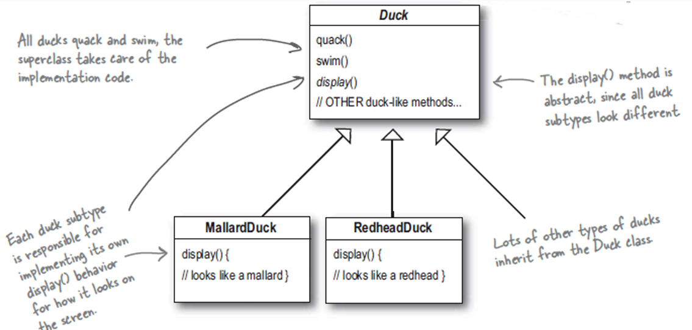
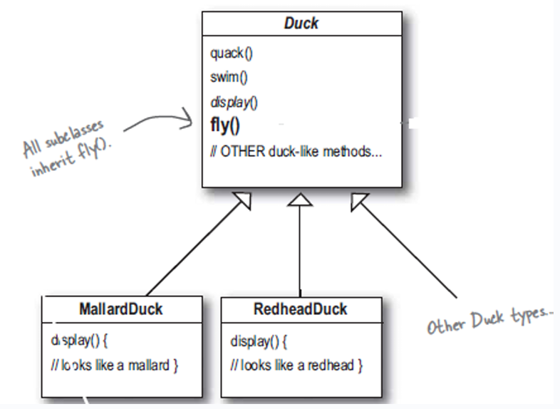
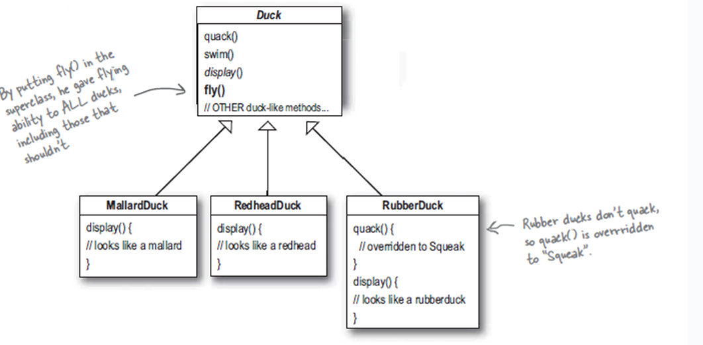
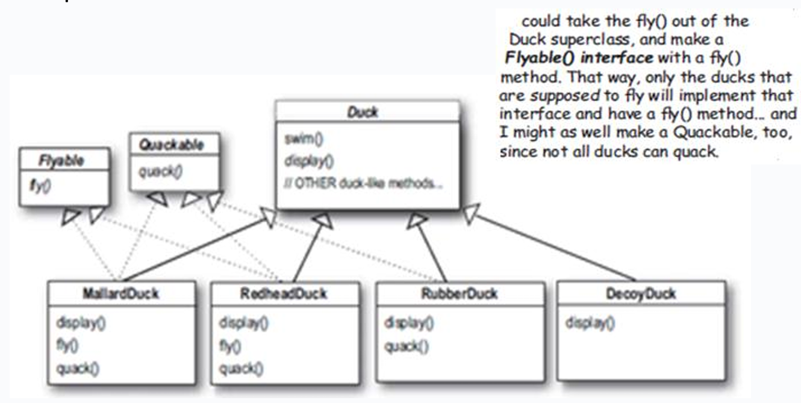
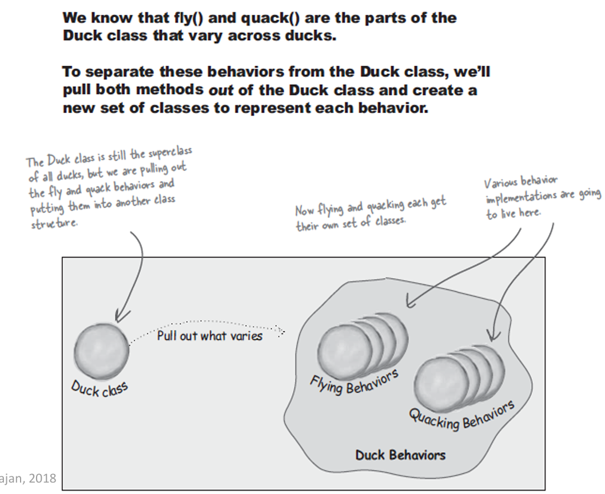
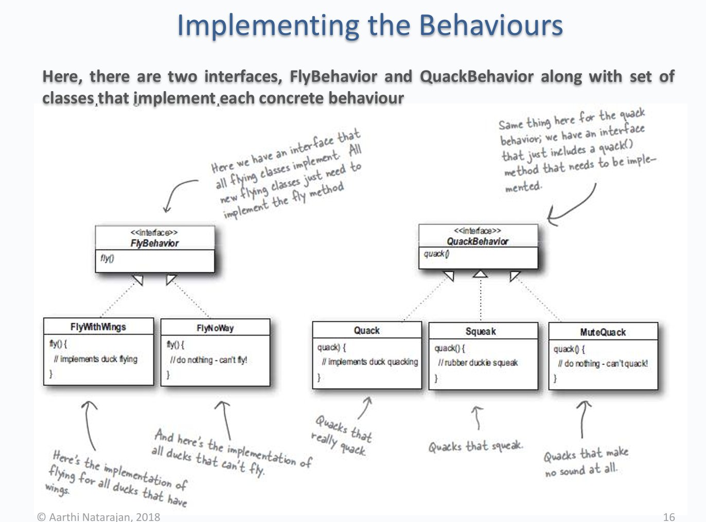
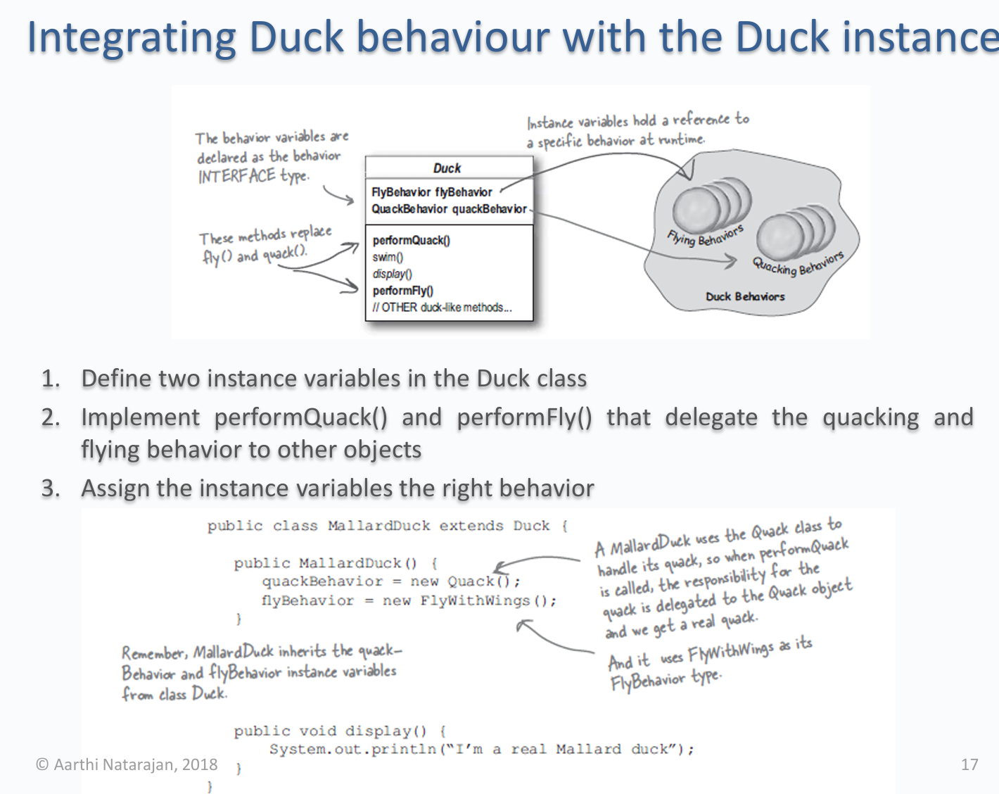
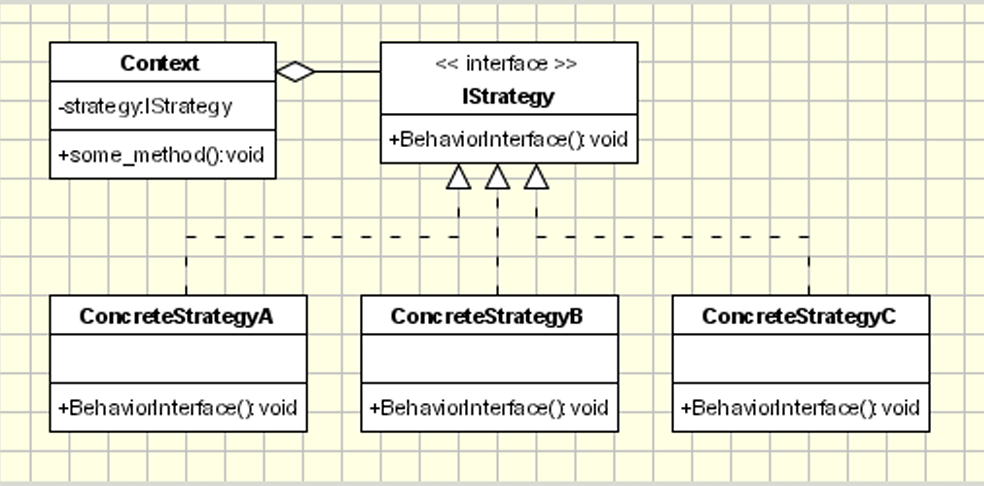

# Context

We start off with an example on a **Duck** base class and their implementations: **MallardDuck** and **RedHeadDuck**.
Currently, these subclasses need to implement their own _display()_ method.


However, the challenge comes when we need to add a **flying** behaviour, or a method called _fly()_.



If we just simply add _fly()_ to the base class, this means all subclasses will inherit this.
However, as you may concern, what happens if there's a duck that can't fly?



In this case, the **RubberDuck** can't fly, but it still inherits the flying behaviour from the subclass.
To overcome this, one might simply override _fly()_ in **RubberDuck**. However, in the future, it may exist some other ducks that don't fly, or having a different flying behaviour. Hence, the cost of maintaining those will be high.

Now how about creating an interface for flying behaviours, and each flyable duck will implement that behaviour.


However, this completely destroys code reuse, and maintenance becomes a nightmare where one change of a behaviour may result in changes in other places (because the same behaviour may be implemeted at multiple classes).

# Key Design Principles

Before coming up with a concrete solution, we may need to review some design principles that are very helpful for building the intuition.

## "Encapsulate code that changes"

Take the parts that vary and encapsulate them, so that later you can alter
or extend the parts that vary without affecting those that don’t.



Considering the above diagram, we know that flying behaviour is what varies across ducks so we can "pull" it out and create a new set of classess to represent this behaviour.

Note that the same is apply to _quack_ behaviours, but I'll just mention flying because they are the same.

## "Program to an interface, not to an implementation"

Take this example:

```java
Dog d = new Dog();
d.bark(); // programming to an implementation

Animal a = new Dog();
a.makeSound(); // programming to an interface
```

Programming to an implementation kinda locks us into using a specific implementation (in the above example, _bark()_).
Switching to programming to an interface, we kinda abstracts the specific behaviour by calling that from the superclass.

One example that might demonstrate the usefulness is the following:

```java
List<Animal> animals = new ArrayList<>();
animals.add(new Dog());
animals.add(new Cat());
animals.add(new Duck());

animals.forEach(animal -> animal.makeSound());
```

We can see that the **animals** list only need to call _makeSound()_ to invoke the specific behaviour of each subclass.

# Solution

We can create an interface called **FlyingBehaviour** and the different flying behaviour subclasses will implement this interface.


Then, we can integrate that into the base class **Duck**:


# Template



# Applicability

- Many related classes differ in their behaviour

  - Example: **RubberDuck** can't fly, or some ducks fly differently than the others.

- A context class can benefit from variants of an algorithm

  - Example: A sorting algorithm can be implemented differently (mergesort, quicksort, bubblesort)

- A class defines many behaviours and these appears as _multiple conditional statements (switch, if-else)_. Instead, move each conditional branch into their own concrete class.
  - [Example](https://nw-syd-gitlab.cseunsw.tech/COMP2511/24T2/content/-/tree/main/lectures/week04/PatternStrategy/car?ref_type=heads): A car has different type of engines. Rather than using _switch-case_ to check what type is it, create a concrete class of that engine and save it as an attribute.

# Benefits

- Use composition over inheritance (we changed from inherit _fly()_ from base class to create a **FlyingBehaviour** class and includes it in the base class)
  => Better **_decoupling_** between behaviour and context class that uses the behaviour

- Strategies can be decided at run-time

# Drawbacks

- As a result created too many objects
- Clients (who will be using the code) must be aware of different strategies (and hence they can decide which one to use).

# Other Examples

- Sorting a list

  - Ex: Quicksort, Mergesort, Bubble Sort
  - Encapsulate each sorting algorithm under a concrete strategy class
  - Context class can be decided at run-time whether which sorting behaviour is needed

- Search
  - Binary search for lists, BFS/DFS for graphs.
