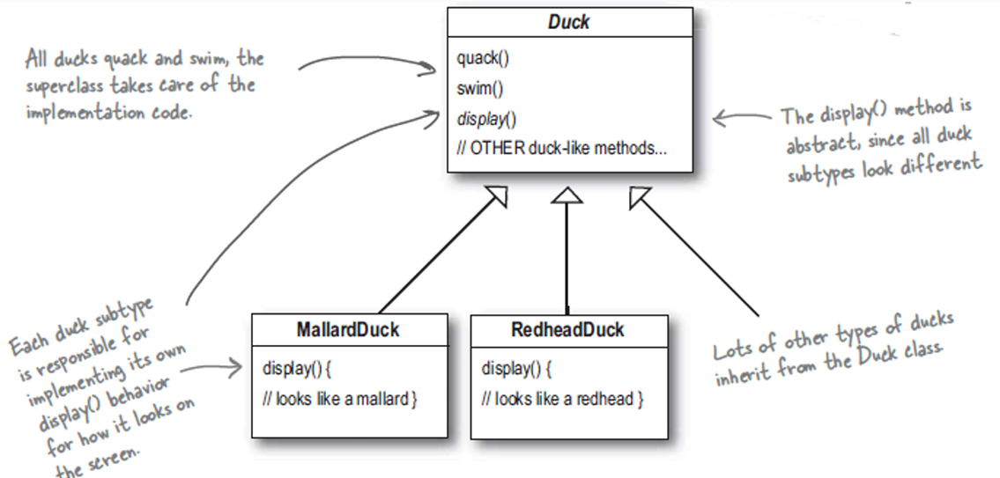
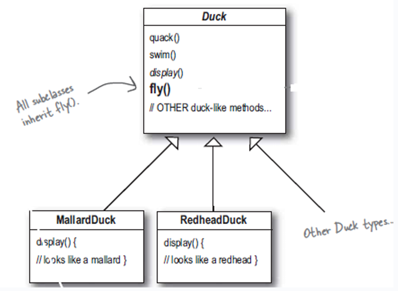

# Context

We start off with an example on a **Duck** base class and their implementations: **MallardDuck** and **RedHeadDuck**.
Currently, these subclasses need to implement their own _display()_ method.

However, the challenge comes when we need to add a **flying** behaviour, or a method called _fly()_.

# Key Design Principles

# "Program to an interface, not to an implementation"

# "Encapsulate code that changes"

# Possible Solutions

# Acceptable Solution
