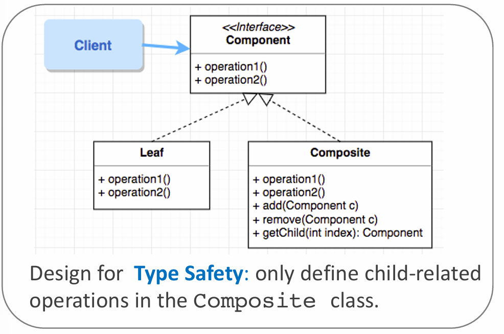
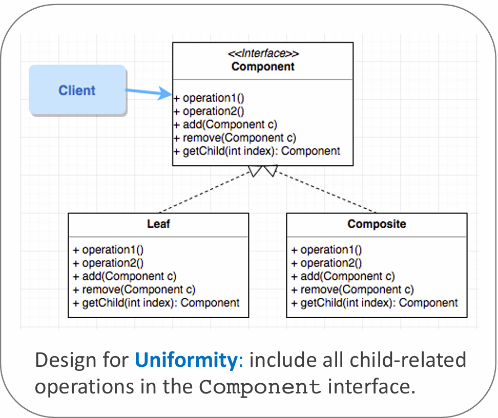

# Aim

- Manipulate a single instance of object just like we do with a group of instances of them.

For example:

- calculating the size of a file == calculating the size of a directory (group of files)
- calculating the total price of a seperate component == calculating the total price of a subcomponent (consists of many parts)

# Possible Solution

- Define a **Component** interface for both **Leaf** (single) objects and **Composite** (group) objects
- Clients can ignore the difference between **Composite** objects and **Leaf** objects by only need to call _operation1()_ and _operation2()_ methods.

# Implementation

## Design for Type Safety

Child-related operations are defined only in the **Composite** class. This prevent **Leaf** objects from calling child-related methods that would end up doing nothing meaningful.

## Design for Uniformity

In contrast to [designing for type safety](#design-for-type-safety), all child-related operations are included in the **Component** interface.

Of course this design will lack of type safety because **Leaf** objects can use child-related methods.

However, uniformity is very beneficial for programs that may dynamically change a **Composite** object to a **Leaf** object and vice versa.

# Demo code

[Found here](https://nw-syd-gitlab.cseunsw.tech/COMP2511/24T2/content/-/tree/main/lectures/week05?ref_type=heads)
