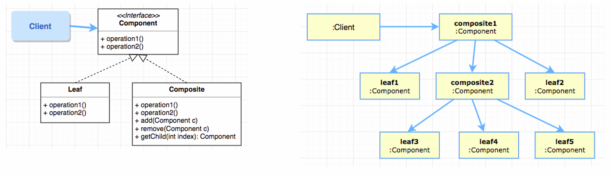

# Aim

- Manipulate a single instance of object just like we do with a group of instances of them.

For example:

- calculating the size of a file == calculating the size of a directory (group of files)
- calculating the total price of a seperate component == calculating the total price of a subcomponent (consists of many parts)

# Possible Solution

